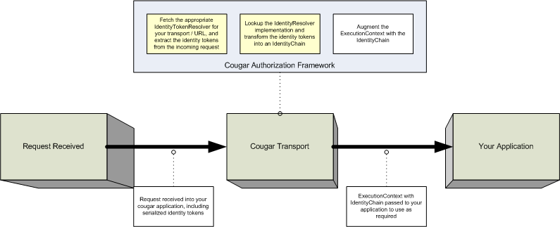

# Authentication and authorization

Cougar does not provide general purpose Authentication / Authorization functionality.  It is up to you as an application
developer to implement an approach that meets particular to your requirements based upon the intended transports, encodings
and any additional parameters, like firewall rules, particular to your problem domain.

To add Authentication and Authorization functionality to your Cougar application, it is necessary to perform the following
steps (shown in yellow on the diagram):

* Implement and configure an IdentityTokenResolver.  The role of the identity token resolver is to deserialize identity
tokens from the incoming request and optionally rewrite them to the response.  An example of this could be extracting the
tokens from a http-header parameter.
* Implement and configure and IdentityResolver.  The role of the identity resolver is to take a set of IdentityTokens and
reconstruct an identity chain from them.  An example implementation may involve converting tokens into identities by querying
a DB.
* Augment your application to take advantage of the Identity Chain presented to it in the ExecutionContext

### IdentityTokenResolver

To create your implementation of this component, you'll need an implementation of the com.betfair.cougar.api.security.IdentityTokenResolver
interface, which is as follows:

    /**
     * Base credential resolver interface. This interface is intended to be extended
     * per transport to provide the resolving, writing and rewriting capabilities
     * required per transport.
     */
    public interface IdentityTokenResolver<I, O> {
        /**
         * Resolve a set of identity tokens, which in turn will be used to
         * resolve identity, from the request. Examples of a credential are a username,
         * a password, or an SSO token.
         * @param input  the data from which the tokens will be read.
         * @return a set of credentials resolved from the request
         */
        public List<IdentityToken> resolve(I input);
        /**
         * Allows the credentials to be re-written to the output. This may be
         * necessary, for example, in the case of an SSO token, where a new token has
         * been issued, and this new token must now be supplied to the client.
         * @param credentials the credentials to rewrite
         * @param output the output to which the token wil be written
         */
        public void rewrite(List<IdentityToken> credentials, O output);
        /**
         * is rewriting the tokens to the output supported
         */
        public boolean isRewriteSupported();
    }

For applications that will be exposed via either Rescript or SOAP, narrowed implementation need to be implemented:

Rescript:

    public interface RescriptIdentityTokenResolver extends IdentityTokenResolver<HttpServletRequest, HttpServletResponse> {}

SOAP:

    public interface SoapIdentityTokenResolver extends IdentityTokenResolver<OMElement, OMElement> {}

When designing how your application will marshal tokens, you should consider any network appliances the request must pass
through in transit - and that any parameter transported as part of an HTTP request is subject to inspection, manipulation
and duplication.