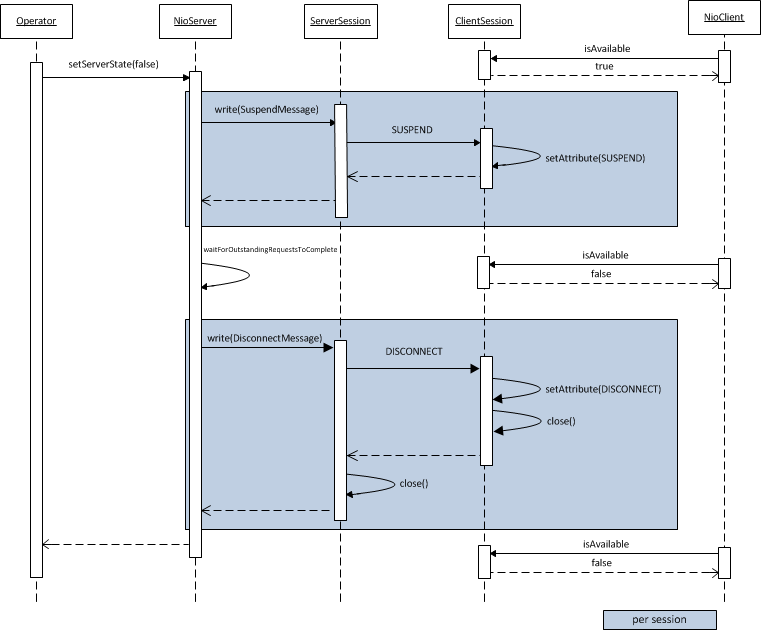

# Cougar Binary Interface Shutdown Sequence

Cougar services that support both http and binary transports, need a mechanism for shutting down the binary interface. While the http traffic can be blocked by taking the node OOS at load balancer, the binary traffic needs to be stopped at the individual node level. We also need to ensure that the inflight requests are served gracefully, before the sessions are closed.

### Approach

* Implement a mechanism to keep track of outstanding requests on server. Its basically a counter thats incremented on ingress and decremented on egress sides.
 * Implement a new protocol message type \**SUSPEND*, to indicate to the client that the session is about to be closed. The client then reacts to this and takes the session out of its local list of available sessions, so no new requests are sent on this session.
* A v2 server only sends this message to a v2 client, to ensure backwards compatibility. However a v2 server still allows all outstanding requests to complete, before closing the session for both versions of clients.
* The feature can be switched off by setting cougar.socket.maxTimeToWaitForRequestCompletion to 0, in which case all sessions will be terminated immediately when a shutdown is requested.

The interaction works as below.

### Test Scenarios covered

* No suspend messages are recieved for v1 client
* No suspend messages are recieved for v2 client when disabled
* Both suspend and disconnect messages are recieved for v2 clients when enabled
* On client side, if a session has "SUSPEND" attribute set, it is not used in subsequent requests.
* On client side, if a session has "DISCONNECT" attribute set, it is not used in subsequent requests.
* On server, when shutdown is requested, SUSPEND and DISCONNECT are sent in the right order for v2 sessions
* On server, when shutdown is requested, only DISCONNECT is sent for v1 sessions
* On server, when shutdown is requested and there are outstanding requests, verify that SUSPEND message is sent first and DISCONNECT message is sent only after all outstanding requests are cleared.